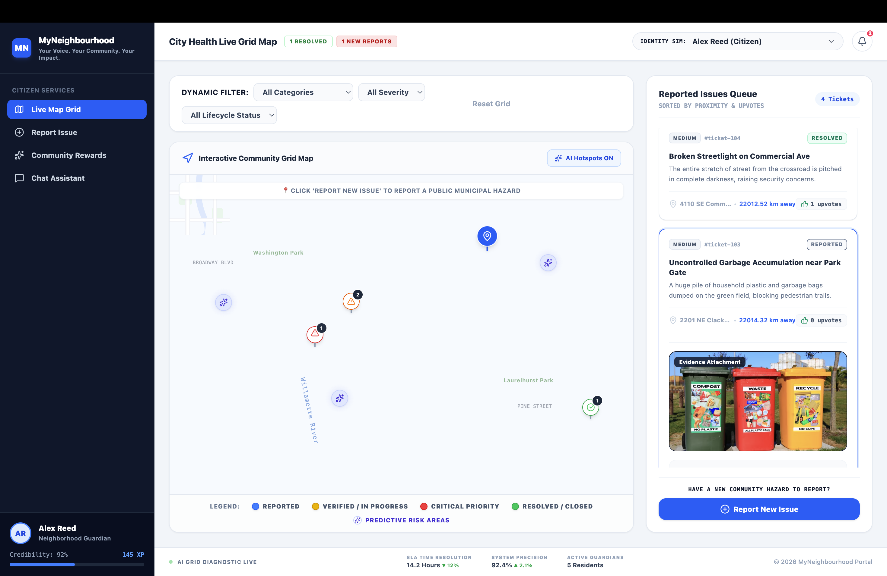
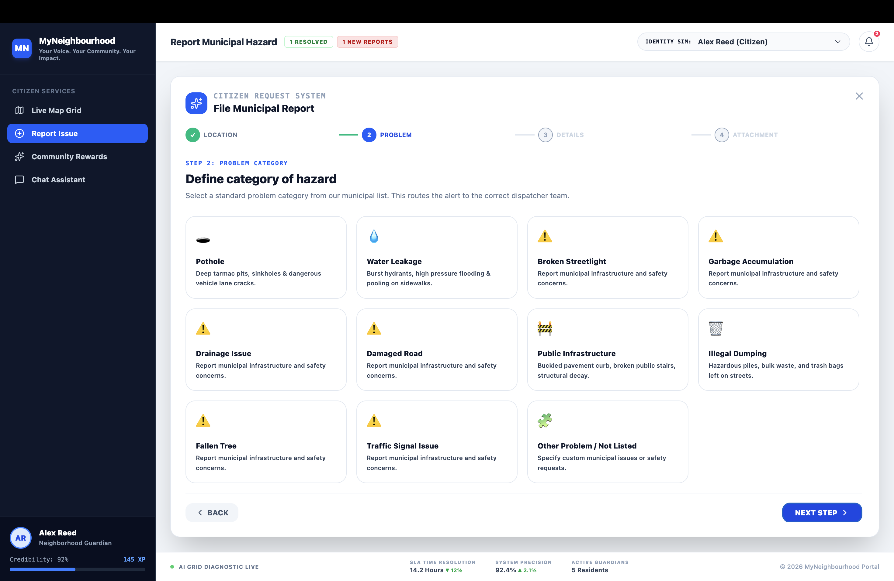
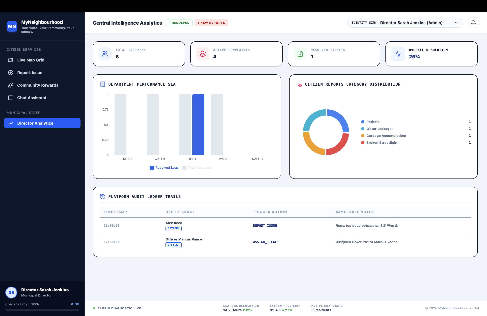
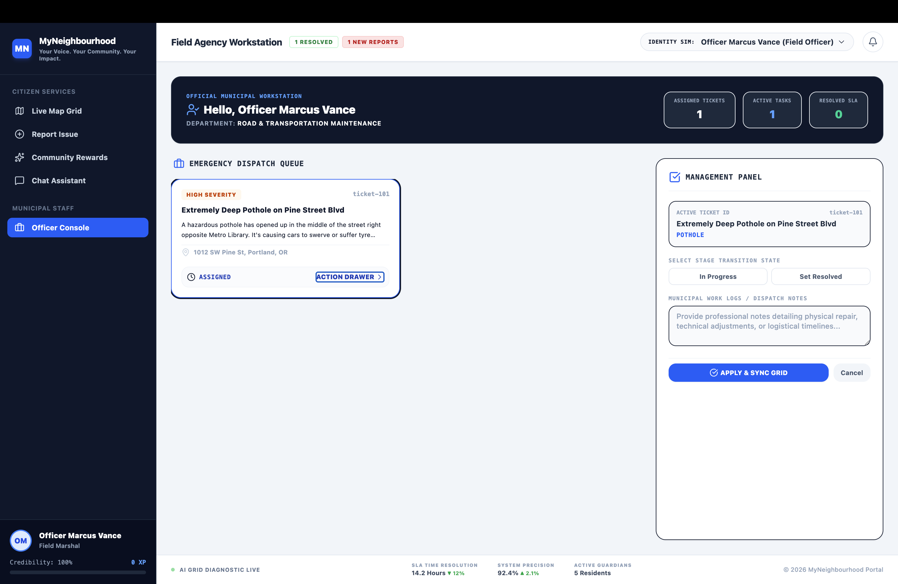

# 🏘️ MyNeighbourhood

> **AI-Powered Smart Civic Issue Reporting Platform built using Google Gemini & Google Maps**

MyNeighbourhood is an intelligent civic engagement platform that enables citizens to report local infrastructure and public service issues in just a few clicks. By leveraging **Google Gemini AI** for image analysis and **Google Maps** for precise location tagging, the platform automatically classifies complaints, determines their severity, and routes them through a transparent workflow from reporting to resolution.

Designed for hackathons like the **Google Solution Challenge**, MyNeighbourhood bridges the communication gap between citizens and municipal authorities by providing a fast, AI-assisted, and transparent complaint management system.

---
# 📷 Screenshots

## 🏠 Home Page



---

## 📍 Complaint Submission



---


## 🛡️ Administrator Dashboard



---

## 👷 Officer Dashboard



---
## 🌟 Features

### 🤖 AI-Powered Issue Detection
- Upload an image of a civic issue
- Google Gemini Vision analyzes the image
- Automatically generates:
  - Issue title
  - Detailed description
  - Category
  - Severity level
  - Suggested municipal department

---

### 📍 Google Maps Integration
- Interactive map for selecting issue location
- Reverse geocoding for accurate address retrieval
- Geo-tagged complaints for precise issue tracking

---

### 👤 Citizen Dashboard
- Register civic complaints
- View complaint history
- Track complaint status in real-time
- Monitor complete issue lifecycle
- Receive transparent updates

---

### 🛡️ Administrator Dashboard
- View all submitted complaints
- Verify AI-generated reports
- Reject duplicate or invalid reports
- Assign complaints to municipal officers
- Monitor overall complaint statistics
- Track department workloads

---

### 👷 Officer Dashboard
- Personalized officer workspace
- View assigned complaints
- Update complaint status
- Add work logs and remarks
- Upload repair evidence
- Mark issues as resolved

---

### 📸 Resolution Evidence System
- Upload completion photographs
- Attach repair evidence before closing issues
- Enables transparent verification
- Prevents false complaint closures

---

### 🚦 Smart Complaint Workflow

```text
Citizen Report
      │
      ▼
 AI Analysis (Gemini)
      │
      ▼
 Administrator Verification
      │
      ▼
 Officer Assignment
      │
      ▼
 In Progress
      │
      ▼
 Resolution Evidence
      │
      ▼
 Resolved
      │
      ▼
 Closed
```

---

### 🚨 Severity-Based Prioritization

Complaints are intelligently classified as:

- 🔴 Critical
- 🟠 High
- 🟡 Medium
- 🟢 Low

Critical issues receive higher visibility and priority.

---

## 🏗️ Tech Stack

### Frontend

- React.js
- Vite
- JavaScript (ES6+)
- Tailwind CSS

### UI

- Lucide React Icons
- Responsive Layout
- Modern Dashboard Components

### Artificial Intelligence

- Google Gemini API
- Gemini Vision Model

### Maps & Location

- Google Maps JavaScript API
- Geolocation API
- Reverse Geocoding

### State Management

- React Hooks
- useState

### Deployment

- Vercel

---

# ☁️ Google Technologies Used

## 🧠 Google Gemini API

Google Gemini powers the intelligent complaint generation by:

- Understanding uploaded images
- Identifying civic issues
- Generating issue titles
- Writing complaint descriptions
- Predicting severity
- Recommending responsible departments

---

## 📍 Google Maps Platform

Used for:

- Interactive map
- Location selection
- Reverse geocoding
- Accurate complaint localization

---

## 🌍 Geolocation Services

- Detects user location
- Simplifies complaint submission
- Improves location accuracy

---


# 🚀 Getting Started

## 1. Clone the Repository

```bash
git clone https://github.com/sohaanigupta18/MyNeighbourhood.git

cd MyNeighbourhood
```

---

## 2. Install Dependencies

```bash
npm install
```

---


## 3. Run the Development Server

```bash
npm run dev
```

The application will be available at:

```
https://civicpulse-ai-630509201643.asia-southeast1.run.app/
```

---


# 🎯 Problem Statement

Citizens often struggle to report civic issues due to fragmented systems, slow response times, and lack of transparency. Municipal authorities, on the other hand, face challenges in efficiently categorizing, prioritizing, and managing a large volume of complaints.

MyNeighbourhood addresses these challenges by combining AI-powered image understanding with location intelligence to create a streamlined, transparent, and citizen-centric complaint management platform.

---


# 📜 License

This project is licensed under the MIT License.

---

# ❤️ Built With

- React
- Tailwind CSS
- Google Gemini
- Google Maps Platform
- Vite
- JavaScript

---
